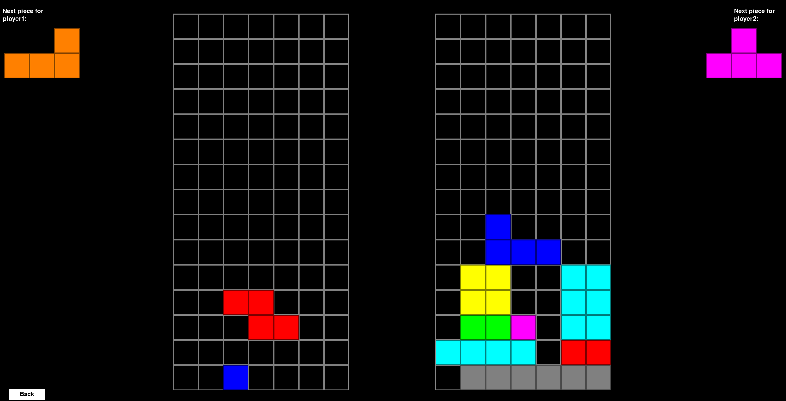
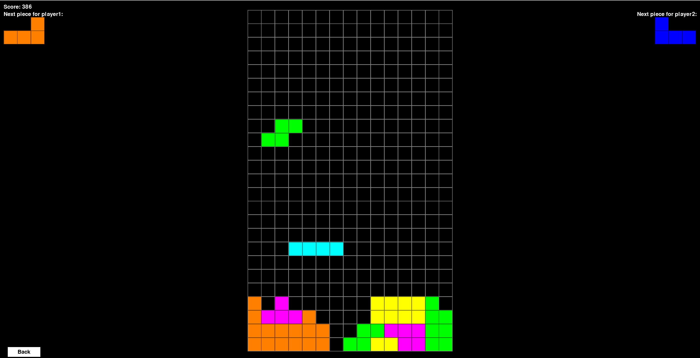

###### Nume: Necula Mihal, Popa Andrei
###### Grupa: 323CA

## TETRIS

1. ### Instructiuni de rulare
	Jocul este creat pentru platforma Linux. 
	Pentru instalare, folositi scriptul `install.sh`.  
	Pentru rulare, folositi scriptul `start.sh`.

1. ### Descriere a proiectului
	
	Jocul este o 'clona' al arhicunoscutului joc Tetris, avand ca inspiratie nivelul 8-1 din 'Pico Park'.  
	Acesta prezinta exclusiv elemente de multiplayer (fiind posibil jucarea singleplayer, insa nu este recomandata) si ofera doua modalitati de a va juca:
	
	- <strong>Modul Duel</strong>: 2 jucatori vor concura sa supravietuiasca cat mai mult, la fiecare `x` linii completate, adaugandu-se inamicului  `x - 1` linii in plus, astfel ducandu-l cu un pas mai aproape de esec.
	
	- <strong>Modul Cooperativ</strong>: 2 jucatori se vor coordona pentru a supravietui cat mai mult si pentru a obtine un scor cat mai mare.
	

	In timpul jocului, se poate observa faptul ca completarea mai multor linii simultan va duce la cumularea unui punctaj mai mare decat daca ar fi fost completate una cate una, iar mentinerea butonului `jos` apasat (`S` sau `sageata jos`) va duce, de asemenea, la cresterea scorului, astfel promovand un stil de joc mai agresiv si mai riscant, intrucat cu cat sunt mai multe linii completate, cu atat piesele vor cobori mai repede. 

1. ### Limbaje / tehnologii folosite
	
	Proiectul este realizat in limbajul `python` si se foloseste de biblioteca `pygame` pentru rendering engine si input / event handler si `numpy` pentru calcule matematice mai complexe. De asemenea, folosim si bibliotecile `os` si `sys` pentru anumite functionalitati specifice sistemului de operare.

1. ### Contributii si dificultati

	- Popa Andrei:

		- Engine-ul jocului
		- Clasa object (nu clasa object default din python)
		- Modul de joc Cooperativ
		- UI

	O principala dificultate intampinata a fost faptul ca rendering-ul realizat de pygame foloseste CPU-ul (nu este hardware accelerated) si astfel, la finalul proiectului jocul mergea foarte incet (<30 fps) si a fost necesara o optimizare in rendering-ul boardu-lui (in metoda `draw`): in loc ca fiecare patrat sa fie desenat separat in fiecare frame, board-ul va fi redesenat odata cu fiecare schimbare, toata desenarea realizand-use intr-un surface separat care va fi pus, la randul lui, in surface-ul principal (`application surface`), astfel >400 draw calls devin doar 1 singur draw call, ceea ce a optimizat jocul suficient pentru a mentine consistent 60 fps. 
	Alta dificultate a fost rotirea consistenta a unui sprite in jurul unui punct (folosirea pygame pentru a roti un surface va roti textura astfel incat coltul din stanga sus ramane constant pe loc, modificandu-se bounding boxul - functionalitate ce nu functioneaza exact cum as vrea). Cu toate ca nu a fost necesara, `draw_sprite_ext` poate roti o textura pe ecran in jurul punctului de origine al texturii(implicit 0x0 = stanga sus, poate fi modificat la incarcarea sprite-ului folosind `sprite_load`). Aceasta problema a fost rezolvata folosind putina matematica si un [raspuns foarte bun](https://stackoverflow.com/questions/4183208/how-do-i-rotate-an-image-around-its-center-using-pygame) de pe stackoverflow.

	- Necula Mihai:
		
		- Clasa de tetromino
		- Clasa de board
		- Modul de joc Duel
		- UI

	Principala dificultate intampinata a fost faptul ca in momentul in care apareau linii 'garbage' la adversar, exista posibilitatea ca piesa care cade sa se contopeasca cu alte piese. Acest lucru se intampla din cauza faptului ca mai multe piese ajungeau sa imparta aceleasi coordonate. Pentru a rezolva aceasta problema, a trebuit sa creez un mecanism de impingere: o piesa care cade poate fi impinsa in sus de celelalte piese in cazul in care ele sunt impinse de aparitia unor noi linii 'garbage'.

1. ### [Link de github](https://github.com/Mhail027/Tetris) 